# Hostel Management System

## 1. Project Overview

I designed and implemented this full-stack Hostel Management System to address the core operational challenges faced by the Chozha Boys Hostel. The previous manual system suffered from inefficient attendance tracking, delayed complaint resolution, and opaque financial records for mess bills. 

This system acts as the digital backbone of the hostel, bridging the gap between three key stakeholders:
*   **Students:** Who need transparency in billing, easy complaint registration, and mobile-friendly attendance checking.
*   **Wardens:** Who require tools to manage student data, track leave requests, and ensure discipline.
*   **Admins:** Who need a high-level overview of finances, occupancy, and system-wide settings.

This is not just a CRUD application; it is a production-grade solution running with real payments, heavy database interactions, and strict security protocols suited for an institutional environment.

## 2. Key Features

Every feature in this system was built to solve a specific operational bottleneck.

*   **Student Authentication & Security:** I implemented a secure login flow using JWTs and role-based redirects. The system prevents unauthorized access to admin routes and ensures students can only view their own financial data.
*   **Role-Based Access Control (RBAC):** The system strictly separates Student and Admin dashboards. Admins have writes-access to global settings and student records, while students have read-only access to bills and write-access only for their own complaints.
*   **Automated Mess Billing System:** One of the most critical features. The system calculates bills based on variable parameters, pushes them to students, and tracks payment status in real-time.
*   **Payment Gateway Integration:** I integrated Cashfree to handle payments. Unlike simple integrations, this handles webhooks to ensure that even if a user closes the browser during payment, the server receives the confirmation and updates the database asynchronously.
*   **Complaint Redressal Mechanism:** A ticketing system where students file complaints (electrical, plumbing, mess) and track their status from "Pending" to "Resolved". This enforces accountability for the hostel staff.
*   **Smart Attendance:** The system allows for digital attendance tracking, reducing the paperwork and allowing for date-range querying to analyze student presence trends.
*   **Rate Limiting & Security:** To prevent abuse, I implemented sliding-window rate limiting using Redis, ensuring that the API cannot be flooded with requests.

## 3. System Architecture

I chose a robust architecture focusing on data integrity and performance.

*   **Frontend:** React.js (Vite)
    *   Chosen for its Virtual DOM efficiency and the rich ecosystem of libraries. I used strict component modularity to keep the codebase maintainable.
*   **Backend:** Node.js & Express.js
    *   Node's non-blocking I/O is ideal for handling concurrent requests, especially during peak times like mess bill deadlines.
*   **Database:** PostgreSQL
    *   I explicitly chose a relational database over MongoDB because financial data (bills, payments) and structured student data require strict schema enforcement and transactional integrity (ACID properties).
*   **Caching & Session:** Redis (Upstash)
    *   Used for rate limiting and transient session data. It offloads the read burden for high-frequency checks.
*   **Payment Gateway:** Cashfree
    *   Selected for its reliable test mode and webhook support, allowing for robust transaction verification scenarios.

**Data Flow:**
Client (React) → API Gateway (Express) → Middleware (Sanitization/Auth) → Controller → PostgreSQL / Redis → Response.

## 4. Backend Deep Dive

The backend is structured to separate concerns entirely. I avoided putting logic in the route definitions.

*   **Folder Structure:**
    *   `api/`: Entry point, server configuration, and strict middleware application.
    *   `controllers/`: Contains the business logic. Each controller functions independently (e.g., `paymentWebhook.js`, `registeration.js`).
    *   `routers/`: strictly defines API endpoints and maps them to controllers. This allows for cleaner code reviews and easier refactoring.
    *   `middlewares/`: Global interceptors. `sanitizeInput.js` cleans every request body to prevent XSS, and `rateLimiter.js` protects the server from DDoS.
    *   `database/`: Connection pools for PostgreSQL and Redis.

*   **Authentication Logic:**
    *   I use `passport` alongside `jsonwebtoken`. When a user logs in, a token is issued and stored (cookie/local storage strategy). Middleware intercepts protected routes, verifies the token signature, and attaches the user profile to the request object.

*   **Database Design:**
    *   The schema uses normalized tables (`students`, `mess_bill_for_students`, `payments`) to reduce redundancy. Foreign keys link payments to bills, ensuring that a payment record cannot exist without an associated bill.

*   **Error Handling:**
    *   I implemented a centralized error handling strategy. Instead of crashing the server, exceptions are caught, logged with context, and a sanitized error message is returned to the client with the appropriate HTTP status code (400 vs 500).

## 5. Frontend Deep Dive

The frontend is built for speed and user experience.

*   **Core Logic (`src/App.jsx`):**
    *   I used React Router v6's data loaders (`dashboardLoader`, `adminDashboardLoader`). This is a critical design decision: it ensures that authentication checks happen *before* the component attempts to render, eliminating the "flash of unauthenticated content" often seen in simpler React apps.
    
*   **State Management:**
    *   I manage auth state using a combination of LocalStorage (for persistence across tabs) and in-memory state. Axios interceptors are configured to automatically attach credentials to outgoing requests.

*   **Component Structure:**
    *   `Admin Dashboard` and `Student Dashboard` are completely isolated. Shared UI elements like Buttons or Form inputs live in `Common/` to enforce a consistent design system (DRY principle).

*   **Form Handling:**
    *   Forms, such as the registration or complaint forms, utilize real-time validation. Input data is checked for format correctness (e.g., phone numbers, email domains) before it is ever sent to the server.

## 6. Payment Flow Explanation

Financial integrity was my top priority here. I did not rely solely on the frontend to tell the backend that a payment was successful.

1.  **Initiation:** The student requests a payment order. The backend generates a secure hash and requests a `session_id` from Cashfree.
2.  **Processing:** The user completes the payment on the gateway.
3.  **Verification (The Critical Step):** 
    *   Instead of trusting the client-side redirect, I implemented a **Webhook** listener at `/api/webhook`.
    *   When Cashfree charges the card, it hits my server with a signed payload.
    *   I verify the `x-webhook-signature` to ensure the request is genuinely from Cashfree.
4.  **Deduplication:** 
    *   I query the database to check if this `payment_id` has already been processed. This handles cases where the gateway sends retry webhooks.
5.  **Settlement:**
    *   Only after verification and deduplication do I update the `mess_bill_for_students` table to set `ispaid = true`.

This flow guarantees that a student is never credited for a failed payment, and legitimate payments are never missed even if the user loses internet connection immediately after paying.

## 7. Security Considerations

*   **SQL Injection:** I used parameterized queries (`$1`, `$2`) throughout the `pg` library usage. No user input is ever concatenated directly into a SQL string.
*   **XSS Protection:** The `sanitizeInput` middleware recursively cleans all incoming JSON bodies and query parameters using `sanitize-html`, stripping out malicious scripts before they reach the controller.
*   **Rate Limiting:** Using Redis, I track IP addresses and block clients that exceed defined request thresholds (e.g., 5 requests per minute for sensitive routes).
*   **Signature Verification:** All financial webhooks are cryptographically verified using the client secret.

## 8. Scalability & Performance

*   **Connection Pooling:** I used `pg.Pool` to manage database connections. This allows the application to handle multiple concurrent users without the overhead of opening/closing a TCP connection for every query.
*   **Redis Caching:** High-velocity write operations (like rate limit counting) are offloaded to Redis, which is much faster than hitting the disk-based PostgreSQL for transient data.
*   **Statelessness:** The API is RESTful and stateless (relying on tokens), meaning horizontal scaling is simplified. We can spin up multiple instances of this backend behind a load balancer without worrying about sticky sessions.

## 9. Installation & Setup

### Prerequisites
*   Node.js (v18+)
*   PostgreSQL
*   Redis (or Upstash account)

### Backend Setup
1.  Navigate to `Hostel_Management_Backend`.
2.  Run `npm install`.
3.  Create a `.env` file in `Hostel_Management_Backend/api/` with the following:
    ```env
    DB_USER=postgres
    DB_HOST=localhost
    DB_NAME=hostel_db
    DB_PASSWORD=yourpassword
    DB_PORT=5432
    UPSTASH_REDIS_REST_URL=your_url
    UPSTASH_REDIS_REST_TOKEN=your_token
    APP_ID=cashfree_app_id
    PAYMENT_KEY=cashfree_secret_key
    ```
4.  Start server: `node api/index.js`.

### Frontend Setup
1.  Navigate to `Chozha-Boys-Hostel-Management-System`.
2.  Run `npm install`.
3.  Start dev server: `npm run dev`.

## 10. API Documentation

I have maintained detailed documentation for the API.
*   **Endpoints:** Organized by domain (`/students`, `/admin`, `/payment`).
*   **Format:** All endpoints accept and return JSON.
*   A complete HTML documentation file `API_DOCUMENTATION.html` is included in the backend root for easy reference by frontend developers or third-party integrators.


## 11. API Sequence Diagrams (Per Endpoint)

> Each API endpoint has its own dedicated UML sequence diagram below, illustrating the complete request lifecycle — from client request through middleware, business logic, database operations, and response. Payment endpoints include the **Cashfree** gateway as a third-party participant.

---

### 11.1 Registration & Account Creation

#### 1 · `POST /students/emailpush` — Initiate Email Verification

```mermaid
sequenceDiagram
    actor User
    participant Backend
    User->>+Backend: POST /students/emailpush {email}
    Backend->>Backend: SELECT students WHERE email (duplicate check)
    Backend->>Backend: SELECT registration_email_verification WHERE email
    alt No record or expired
        Backend->>Backend: Generate random sequence string
        Backend->>Backend: Sign JWT with {email, sequence}
        Backend->>Backend: INSERT verification record (10 min TTL)
        Backend-->>-User: ✅ 200 {success: true, token}
    else Active verification ongoing
        Backend-->>-User: ❌ 200 {success: false, "already ongoing"}
    end
```

#### 2 · `POST /students/sendcode` — Send 6-Digit OTP via Email

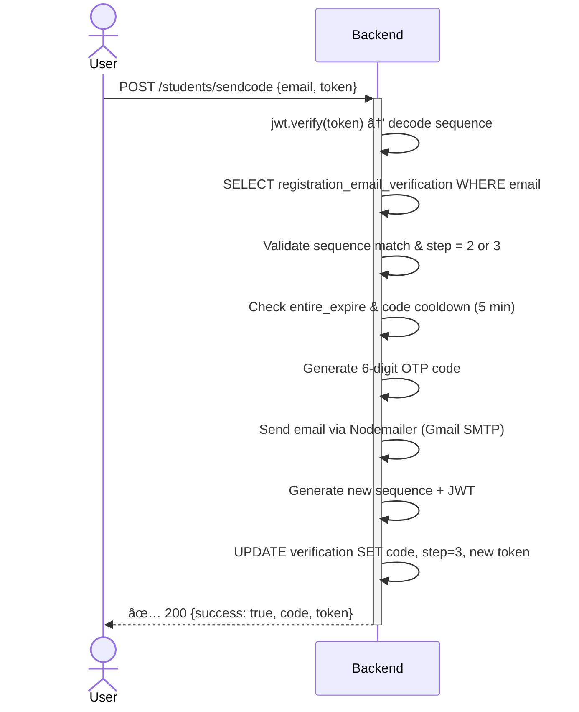

#### 3 · `POST /students/emailverify` — Verify OTP Code

```mermaid
sequenceDiagram
    actor User
    participant Backend
    User->>+Backend: POST /students/emailverify {email, code, token}
    Backend->>Backend: SELECT registration_email_verification WHERE email
    Backend->>Backend: jwt.verify(token) → validate sequence
    Backend->>Backend: Check entire_expire not expired
    Backend->>Backend: Validate token matches & step = 3 or 4
    alt Code matches
        Backend->>Backend: Generate new sequence + JWT
        Backend->>Backend: UPDATE SET verified=true, step=4, new token
        Backend-->>-User: ✅ 200 {success: true, "Email verified", token}
    else Code mismatch
        Backend-->>-User: ❌ 200 {success: false, "Invalid code"}
    end
```

#### 4 · `POST /students/register` — Complete Registration

```mermaid
sequenceDiagram
    actor User
    participant Backend
    User->>+Backend: POST /students/register {email, password, name, ...15 fields}
    Backend->>Backend: Validate required fields (email, password, name, reg_no)
    Backend->>Backend: SELECT students WHERE email (duplicate check)
    Backend->>Backend: SELECT registration_email_verification WHERE email
    Backend->>Backend: jwt.verify(token) → validate sequence & step=4
    Backend->>Backend: Confirm verified=true & not expired
    Backend->>Backend: bcrypt.hash(password, 10) → hashedPassword
    Backend->>Backend: INSERT INTO students (...17 columns) RETURNING id
    Backend->>Backend: DELETE FROM registration_email_verification WHERE email
    Backend-->>-User: ✅ 201 {success: true, user: {id, email, name}}
```

#### 5 · `GET /students/fetchdepartments` — List Departments

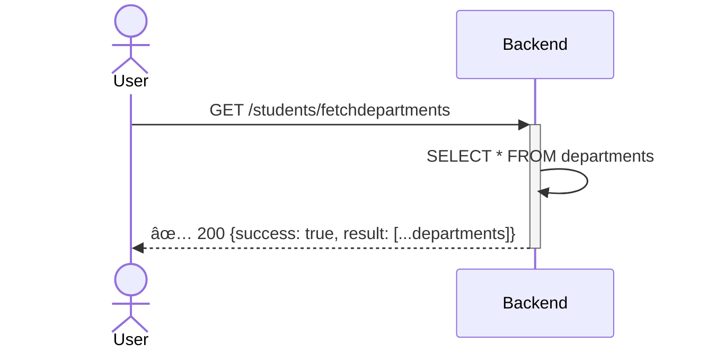

---

### 11.2 Authentication & Token Management

#### 6 · `POST /students/studentslogin` — Student Login

```mermaid
sequenceDiagram
    actor User
    participant Backend
    User->>+Backend: POST /students/studentslogin {email, password, deviceInfo}
    Backend->>Backend: SELECT students WHERE email
    alt Student not found
        Backend-->>-User: ❌ 404 "No student found"
    else Student found
        Backend->>Backend: bcrypt.compare(password, hashedPassword)
        alt Password invalid
            Backend-->>-User: ❌ 401 "Invalid password"
        else Password valid
            Backend->>Backend: jwt.sign({id, email, role:"student"}) → refreshToken
            Backend->>Backend: INSERT refreshtokens (user_id, token, device_info)
            Backend->>Backend: jwt.sign({id, email, role, refreshtokenId}) → accessToken
            Backend->>Backend: Set cookies: refreshToken, refreshTokenId, role
            Backend-->>-User: ✅ 200 {token, role:"student", data: userData}
        end
    end
```

#### 7 · `POST /admin/adminslogin` — Admin Login

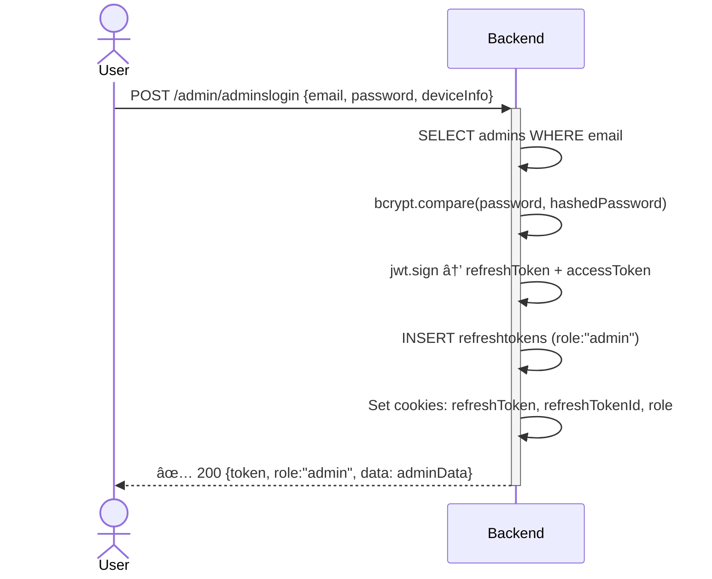

#### 8 · `POST /students/generateauthtokenforstudent` — Refresh Student Token

```mermaid
sequenceDiagram
    actor User
    participant Backend
    User->>+Backend: POST /students/generateauthtokenforstudent (cookie: refreshToken)
    Backend->>Backend: Read refreshToken from cookies
    Backend->>Backend: SELECT refreshtokens WHERE tokens = refreshToken
    alt Token not found in DB
        Backend->>Backend: Clear cookies (studentToken, refreshToken)
        Backend-->>-User: ❌ 403 "Invalid Refresh Token"
    else Token found & role = "student"
        Backend->>Backend: SELECT students WHERE id = user_id
        Backend->>Backend: jwt.sign({id, email, role, refreshtokenId}) → new accessToken
        Backend->>Backend: Set cookie: studentToken (2h TTL)
        Backend->>Backend: UPDATE refreshtokens SET recent_authtoken_issued_time = NOW()
        Backend-->>-User: ✅ 200 {token, data: userData}
    end
```

#### 9 · `POST /admin/generateauthtokenforadmin` — Refresh Admin Token

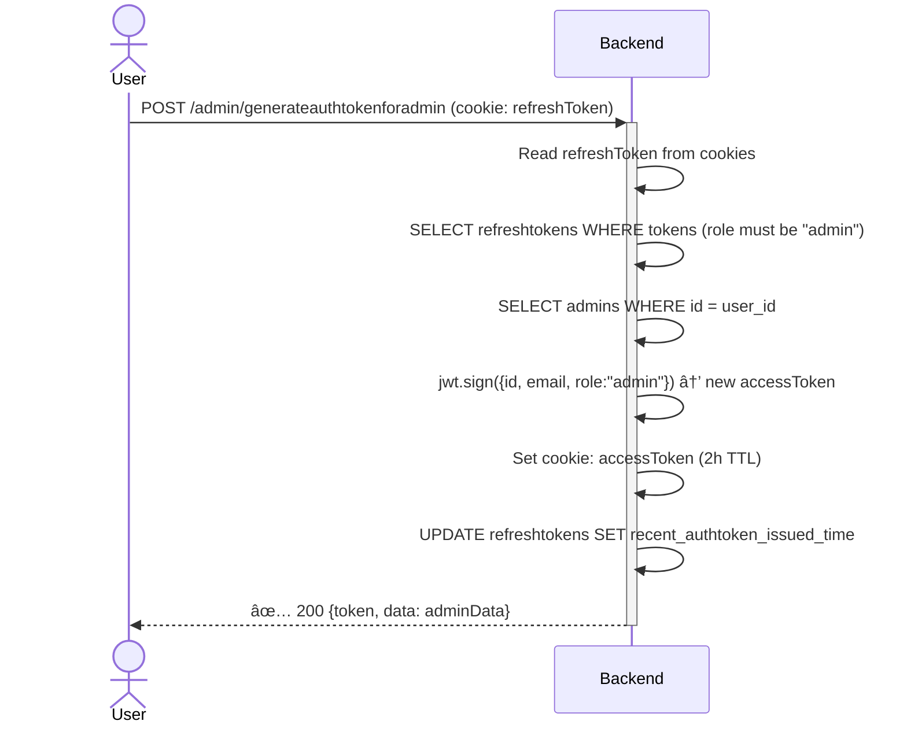

#### 10 · `POST /students/get-session` — Get Active Sessions

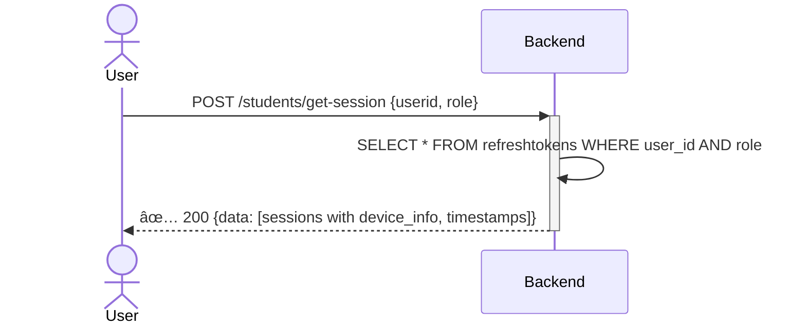

#### 11 · `POST /students/remove-session` — Revoke a Session

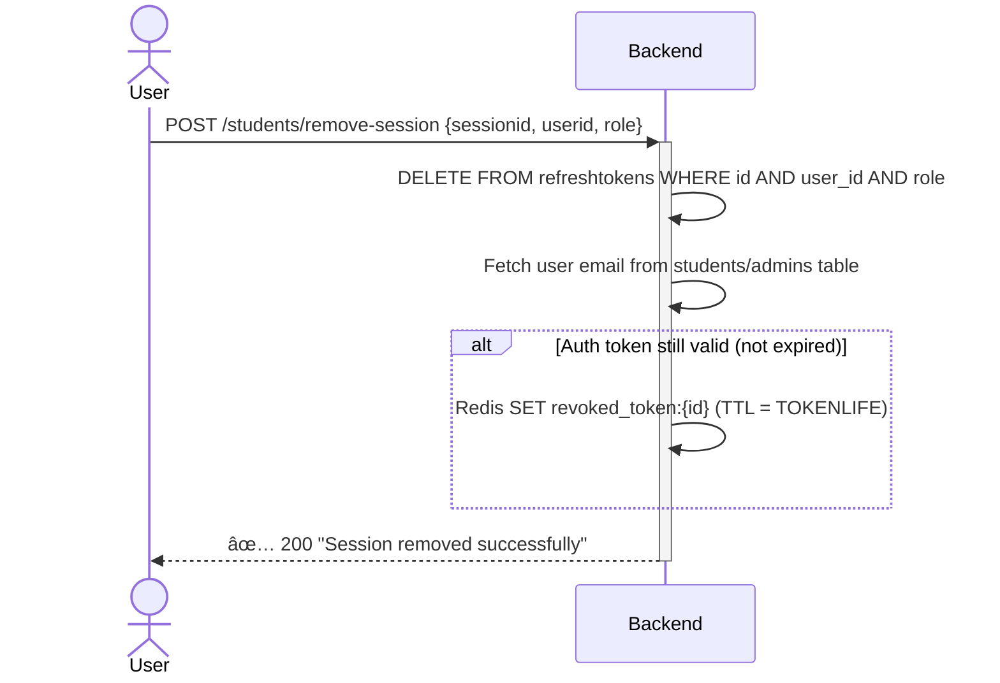

#### 12 · `POST /students/logout` — Student Logout

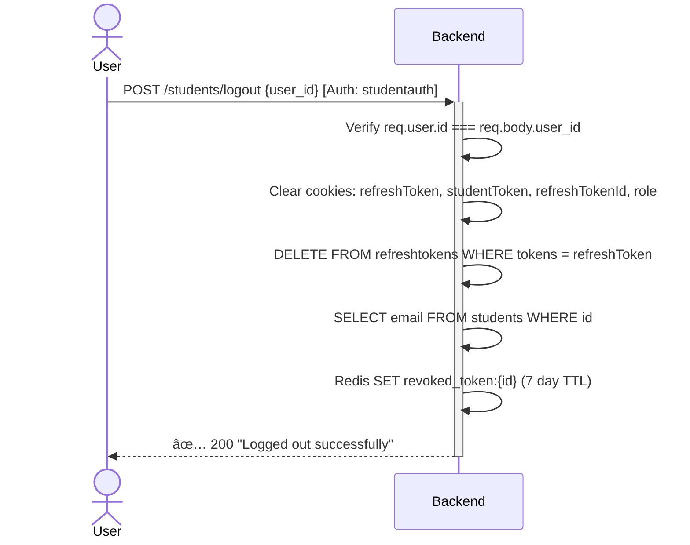

#### 13 · `POST /admin/logout` — Admin Logout

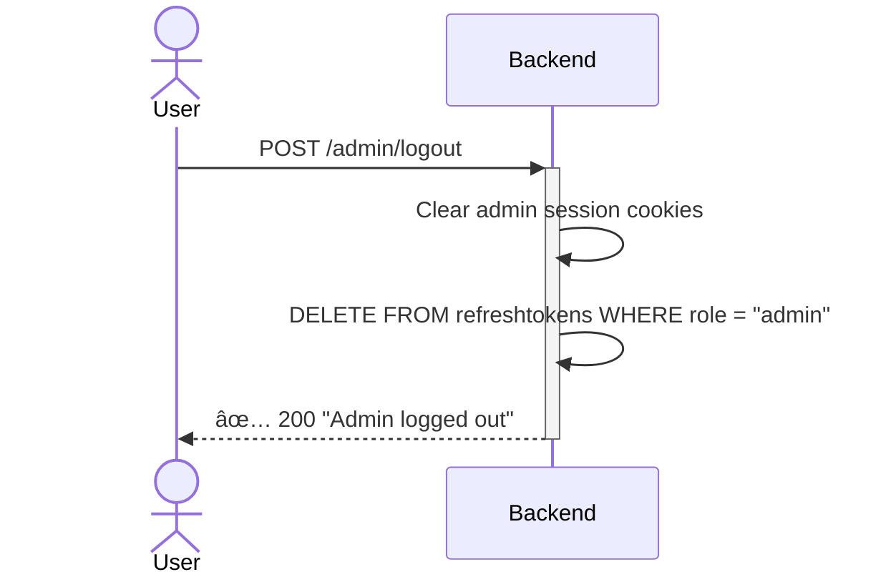

---

### 11.3 Forgot Password Flow

#### 14 · `POST /students/forgotpasswordemailpush` — Initiate Password Reset

```mermaid
sequenceDiagram
    actor User
    participant Backend
    User->>+Backend: POST /students/forgotpasswordemailpush {email}
    Backend->>Backend: SELECT students WHERE email (must exist)
    Backend->>Backend: SELECT emailverificationforgot WHERE email
    alt No record or expired
        Backend->>Backend: Generate sequence + sign JWT
        Backend->>Backend: INSERT emailverificationforgot (step=2, 10 min TTL)
        Backend-->>-User: ✅ 200 {success: true, token}
    else Active process & not expired
        Backend-->>-User: ❌ 200 "Verification already ongoing"
    end
```

#### 15 · `POST /students/forgotpasswordsendcode` — Send Reset OTP

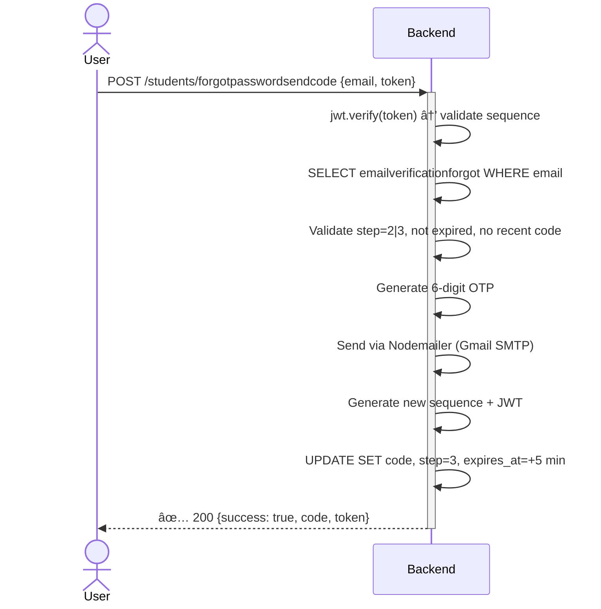

#### 16 · `POST /students/veriycodeforgot` — Verify Reset OTP

```mermaid
sequenceDiagram
    actor User
    participant Backend
    User->>+Backend: POST /students/veriycodeforgot {email, code, token}
    Backend->>Backend: SELECT emailverificationforgot WHERE email
    Backend->>Backend: jwt.verify(token) → validate sequence match
    Backend->>Backend: Check not expired & step=3|4
    alt Code matches
        Backend->>Backend: Generate new sequence + JWT
        Backend->>Backend: UPDATE SET verified=true, step=4
        Backend-->>-User: ✅ 200 {success: true, token}
    else Code invalid
        Backend-->>-User: ❌ 200 "Invalid code"
    end
```

#### 17 · `POST /students/changepassword` — Reset Password

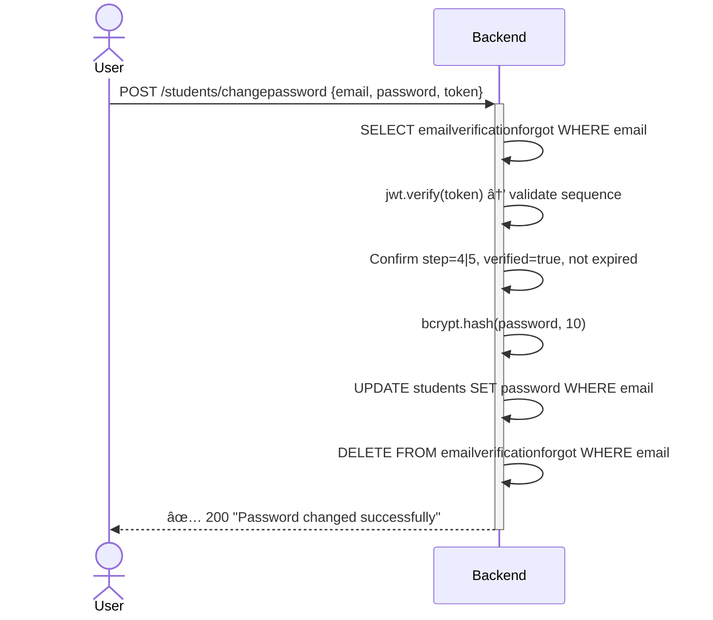

### 11.4 Student Attendance

#### 18 · `POST /students/attendance` — Mark Present (Geofenced)

```mermaid
sequenceDiagram
    actor User
    participant Backend
    User->>+Backend: POST /students/attendance {lat, lng} [Auth: studentauth]
    Backend->>Backend: Parse student coordinates (lat, lng)
    Backend->>Backend: Load hostel coordinates from env (HOSTEL_LAT, HOSTEL_LNG)
    Backend->>Backend: Calculate distance → isInHostel(student, hostel, RADIUS)
    alt Student NOT inside hostel geofence
        Backend-->>-User: ❌ 403 "Student not inside hostel"
    else Inside geofence
        Backend->>Backend: INSERT attendance (student_id, "Present") ON CONFLICT DO NOTHING
        alt Already marked today
            Backend-->>-User: ⚠️ 200 "Attendance already marked for today"
        else Success
            Backend-->>-User: ✅ 200 {success: true, attendance: record}
        end
    end
```

#### 19 · `POST /students/absent` — Mark Absent (Geofenced)

```mermaid
sequenceDiagram
    actor User
    participant Backend
    User->>+Backend: POST /students/absent {lat, lng} [Auth: studentauth]
    Backend->>Backend: Parse coordinates → isInHostel(student, hostel, 5000m)
    alt Student IS inside hostel
        Backend-->>-User: ❌ 403 "Student inside hostel" (can't mark absent)
    else Outside hostel
        Backend->>Backend: INSERT attendance (student_id, "Absent") ON CONFLICT DO NOTHING
        Backend-->>-User: ✅ 200 {success: true, attendance: record}
    end
```

#### 20 · `POST /students/showattendance` — View Attendance History

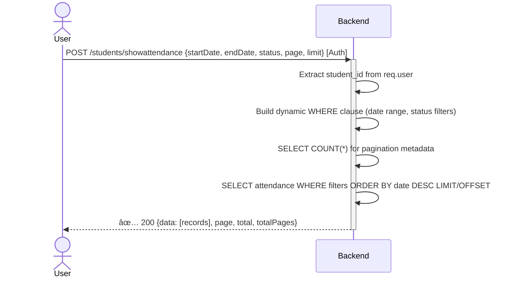

---

### 11.5 Student Complaints

#### 21 · `POST /students/registercomplaints` — File a Complaint

```mermaid
sequenceDiagram
    actor User
    participant Backend
    User->>+Backend: POST /students/registercomplaints {title, description, category, priority} [Auth]
    Backend->>Backend: Extract student_id from req.user
    Backend->>Backend: INSERT complaints (student_id, title, description, category, priority)
    Backend-->>-User: ✅ 200 {success: true, complaint: inserted_record}
```

#### 22 · `PUT /students/editcomplaints` — Edit a Complaint

```mermaid
sequenceDiagram
    actor User
    participant Backend
    User->>+Backend: PUT /students/editcomplaints {complaint_id, title, description, category, priority} [Auth]
    Backend->>Backend: Validate complaint_id is provided
    Backend->>Backend: UPDATE complaints SET title, description, category, priority, updated_at WHERE id
    alt Complaint found
        Backend-->>-User: ✅ 200 {success: true, complaint: updated_record}
    else Not found
        Backend-->>-User: ❌ 404 "Complaint not found"
    end
```

#### 23 · `GET /students/fetchcomplaintsforstudents` — List My Complaints

```mermaid
sequenceDiagram
    actor User
    participant Backend
    User->>+Backend: GET /students/fetchcomplaintsforstudents [Auth: studentauth]
    Backend->>Backend: Extract student_id from req.user
    Backend->>Backend: SELECT * FROM complaints WHERE student_id
    Backend-->>-User: ✅ 200 {success: true, data: [complaints]}
```

---

### 11.6 Student Notifications

#### 24 · `GET /students/fetchnotificationforstudents` — Get Notifications

```mermaid
sequenceDiagram
    actor User
    participant Backend
    User->>+Backend: GET /students/fetchnotificationforstudents [Auth: studentauth]
    Backend->>Backend: Extract student_id from req.user
    Backend->>Backend: SELECT notifications JOIN announcements WHERE student_id AND dismiss=false ORDER BY created_at DESC
    Backend-->>-User: ✅ 200 {success: true, data: [notification_id, title, message, priority, scheduled_date]}
```

#### 25 · `POST /students/dismissnotificationforstudent` — Dismiss Notification

```mermaid
sequenceDiagram
    actor User
    participant Backend
    User->>+Backend: POST /students/dismissnotificationforstudent {notification_id} [Auth]
    Backend->>Backend: DELETE FROM students_dashboard_notifications WHERE id AND student_id
    alt Row deleted
        Backend-->>-User: ✅ 200 "Notification deleted successfully"
    else Not found
        Backend-->>-User: ❌ 404 "Notification not found"
    end
```

---

### 11.7 Student Profile & Settings

#### 26 · `POST /students/stats` — Fetch Dashboard Statistics

```mermaid
sequenceDiagram
    actor User
    participant Backend
    User->>+Backend: POST /students/stats [Auth: studentauth]
    Backend->>Backend: Extract student_id → SELECT academic_year, department
    Backend->>Backend: COUNT(DISTINCT date) FROM attendance → totalDays
    Backend->>Backend: COUNT attendance WHERE student_id & status="Present" → myDays
    Backend->>Backend: Repeat counts filtered by current calendar year
    Backend->>Backend: SELECT mess_bill + monthly_base_costs JOIN → calculate paid/unpaid amounts
    Backend->>Backend: Loop bills: calculate per-bill amount (mess_fee × days + veg/nonveg extras)
    Backend-->>-User: ✅ 200 {attendance: {overall: %, year: %}, messBill: {paid: ₹, notPaid: ₹}}
```

#### 27 · `POST /students/change-password` — Change Password (Authenticated)

```mermaid
sequenceDiagram
    actor User
    participant Backend
    User->>+Backend: POST /students/change-password {currentPassword, newPassword, confirmPassword} [Auth]
    Backend->>Backend: Extract email from req.user (studentauth middleware)
    Backend->>Backend: Validate all 3 fields present & newPassword === confirmPassword
    Backend->>Backend: SELECT students WHERE email
    Backend->>Backend: bcrypt.compare(currentPassword, stored hash)
    alt Current password incorrect
        Backend-->>-User: ❌ 200 "Incorrect current password"
    else Correct
        Backend->>Backend: bcrypt.genSalt(10) → bcrypt.hash(newPassword)
        Backend->>Backend: UPDATE students SET password WHERE email
        Backend-->>-User: ✅ 200 "Password updated successfully"
    end
```

---

### 11.8 Payment — Cashfree Integration

#### 28 · `POST /students/create-order` — Create Payment Order

```mermaid
sequenceDiagram
    actor User
    participant Backend
    participant Cashfree
    User->>+Backend: POST /students/create-order {student_id, year_month, student_name, student_email, student_phone} [Auth]
    Backend->>Backend: SELECT mess_bill JOIN monthly_base_costs WHERE student_id AND month_year
    alt Bill not found
        Backend-->>-User: ❌ 404 "Bill not found"
    else Bill found
        Backend->>Backend: Check ispaid — reject if already paid
        Backend->>Backend: Calculate total_amount (mess_fee × days + veg/nonveg extras)
        Backend->>Backend: Generate unique orderId (student_id + year_month + timestamp)
        Backend->>+Cashfree: PGCreateOrder {order_amount, order_id, customer_details, notify_url}
        Cashfree-->>-Backend: ✅ {cf_order_id, payment_session_id, order_token}
        Backend->>Backend: UPDATE mess_bill SET latest_order_id = cf_order_id
        Backend-->>-User: ✅ 200 {total_amount, cashfree_response: {session_id, order_token}}
    end
```

#### 29 · `POST /students/create-order1` — Create Order (Simplified)

```mermaid
sequenceDiagram
    actor User
    participant Backend
    participant Cashfree
    User->>+Backend: POST /students/create-order1 {student_id, student_name, student_email, student_phone, amount}
    Backend->>Backend: Generate SHA-256 order ID from crypto.randomBytes(16)
    Backend->>+Cashfree: PGCreateOrder("2023-08-01", {order_amount, order_id, customer_details})
    Cashfree-->>-Backend: ✅ Order response with payment_session_id
    Backend-->>-User: ✅ 200 {cashfree response data}
```

#### 30 · `POST /webhook` — Cashfree Webhook (Server-to-Server)

```mermaid
sequenceDiagram
    participant Cashfree
    participant Backend
    Cashfree->>+Backend: POST /webhook {signed payload, x-webhook-signature, x-webhook-timestamp}
    Backend->>Backend: PGVerifyWebhookSignature(signature, rawBody, timestamp)
    alt Signature invalid
        Backend-->>-Cashfree: ❌ 400 "Invalid signature"
    else Signature valid
        Backend->>Backend: Extract: orderId, cfPaymentId, paymentStatus, customerDetails, gatewayDetails
        Backend->>Backend: SELECT payments WHERE cf_payment_id OR gateway_payment_id (duplicate check)
        alt Duplicate found
            Backend-->>-Cashfree: ✅ 200 {duplicate: true}
        else New payment
            Backend->>Backend: SELECT mess_bill WHERE latest_order_id → get messBillId
            Backend->>Backend: INSERT INTO payments (19 columns: order, payment, customer, gateway details)
            alt paymentStatus === "SUCCESS"
                Backend->>Backend: UPDATE mess_bill SET ispaid=true, status="SUCCESS", paid_date=NOW()
            else Failed/Pending
                Backend->>Backend: UPDATE mess_bill SET status=paymentStatus
            end
            Backend-->>-Cashfree: ✅ 200 {success: true}
        end
    end
```

#### 31 · `POST /students/verify-payment` — Client-Side Payment Verification

```mermaid
sequenceDiagram
    actor User
    participant Backend
    participant Cashfree
    User->>+Backend: POST /students/verify-payment {orderId}
    Backend->>+Cashfree: PGOrderFetchPayments("2023-08-01", orderId)
    Cashfree-->>-Backend: {payments: [{status, amount, ...}]}
    Backend->>Backend: Check if any payment has status === "SUCCESS"
    Backend-->>-User: ✅ 200 {success: true/false, details: payments}
```

#### 32 · `POST /students/showmessbillbyid1` — View My Mess Bills

```mermaid
sequenceDiagram
    actor User
    participant Backend
    User->>+Backend: POST /students/showmessbillbyid1 {page, limit, status, year, month} [Auth]
    Backend->>Backend: Extract student_id from req.user
    Backend->>Backend: Build dynamic WHERE (student_id, show=true, status filter, year/month)
    Backend->>Backend: SELECT COUNT(*) for pagination
    Backend->>Backend: SELECT mess_bill JOIN monthly_base_costs (28 columns) ORDER BY month_year DESC
    Backend-->>-User: ✅ 200 {data: [bills with full cost breakdown], page, total, totalPages}
```

#### 33 · `POST /students/fetch-transaction-history` — Payment History

```mermaid
sequenceDiagram
    actor User
    participant Backend
    User->>+Backend: POST /students/fetch-transaction-history {student_id, month, year, page, limit}
    Backend->>Backend: SELECT payments JOIN mess_bill WHERE customer_id AND show=true
    Backend->>Backend: Apply optional month/year filters on payment_time
    Backend->>Backend: ORDER BY payment_time DESC with LIMIT/OFFSET
    Backend->>Backend: SELECT COUNT(*) for pagination metadata
    Backend-->>-User: ✅ 200 {data: [order_id, amount, status, method, time], pagination}
```

### 11.9 Admin — Student Management

#### 34 · `POST /admin/fetchstudents` — List All Students

```mermaid
sequenceDiagram
    actor User
    participant Backend
    User->>+Backend: POST /admin/fetchstudents [Auth: adminauth]
    Backend->>Backend: SELECT * FROM students (all registered students)
    Backend-->>-User: ✅ 200 {success: true, data: [students]}
```

#### 35 · `PUT /admin/approve/:id` — Approve Student Account

```mermaid
sequenceDiagram
    actor User
    participant Backend
    User->>+Backend: PUT /admin/approve/:id [Auth: adminauth]
    Backend->>Backend: Extract student ID from URL params
    Backend->>Backend: UPDATE students SET approved=true WHERE id
    Backend-->>-User: ✅ 200 {success: true, "Student approved"}
```

#### 36 · `PUT /admin/adminreject/:id` — Reject Student Account

```mermaid
sequenceDiagram
    actor User
    participant Backend
    User->>+Backend: PUT /admin/adminreject/:id [Auth: adminauth]
    Backend->>Backend: Extract student ID from URL params
    Backend->>Backend: UPDATE students SET approved=false / DELETE WHERE id
    Backend-->>-User: ✅ 200 {success: true, "Student rejected"}
```

#### 37 · `PUT /admin/editstudentsdetails` — Edit Student Info

```mermaid
sequenceDiagram
    actor User
    participant Backend
    User->>+Backend: PUT /admin/editstudentsdetails {student_id, fields...} [Auth: adminauth]
    Backend->>Backend: Build dynamic UPDATE query with provided fields
    Backend->>Backend: UPDATE students SET ...fields WHERE id = student_id
    Backend-->>-User: ✅ 200 {success: true, updated: record}
```

#### 38 · `POST /admin/studentupdate` — Bulk Student Update

```mermaid
sequenceDiagram
    actor User
    participant Backend
    User->>+Backend: POST /admin/studentupdate {updates} [Auth: adminauth]
    Backend->>Backend: Process bulk update payload
    Backend->>Backend: UPDATE students with batch data
    Backend-->>-User: ✅ 200 {success: true, "Students updated"}
```

---

### 11.10 Admin — Department Management

#### 39 · `POST /admin/adddepartments` — Create Department

```mermaid
sequenceDiagram
    actor User
    participant Backend
    User->>+Backend: POST /admin/adddepartments {name, ...details} [Auth: adminauth]
    Backend->>Backend: INSERT INTO departments (name, details)
    Backend-->>-User: ✅ 200 {success: true, "Department created"}
```

#### 40 · `PUT /admin/editdepartment` — Update Department

```mermaid
sequenceDiagram
    actor User
    participant Backend
    User->>+Backend: PUT /admin/editdepartment {id, name, ...details} [Auth: adminauth]
    Backend->>Backend: UPDATE departments SET name, details WHERE id
    Backend-->>-User: ✅ 200 {success: true, "Department updated"}
```

#### 41 · `DELETE /admin/deletedepartment` — Remove Department

```mermaid
sequenceDiagram
    actor User
    participant Backend
    User->>+Backend: DELETE /admin/deletedepartment {id} [Auth: adminauth]
    Backend->>Backend: DELETE FROM departments WHERE id
    Backend-->>-User: ✅ 200 {success: true, "Department deleted"}
```

---

### 11.11 Admin — Attendance Management

#### 42 · `POST /admin/showattends` — View All Attendance

```mermaid
sequenceDiagram
    actor User
    participant Backend
    User->>+Backend: POST /admin/showattends {filters, pagination} [Auth: adminauth]
    Backend->>Backend: Build query with date/student/status filters
    Backend->>Backend: SELECT attendance with JOIN students for context
    Backend-->>-User: ✅ 200 {data: [attendance records], pagination}
```

#### 43 · `PUT /admin/changeattendanceforadmin` — Modify Attendance

```mermaid
sequenceDiagram
    actor User
    participant Backend
    User->>+Backend: PUT /admin/changeattendanceforadmin {student_id, date, status} [Auth: adminauth]
    Backend->>Backend: UPDATE attendance SET status WHERE student_id AND date
    Backend-->>-User: ✅ 200 {success: true, "Attendance modified"}
```

#### 44 · `POST /admin/exportattendance` — Export Attendance Data

```mermaid
sequenceDiagram
    actor User
    participant Backend
    User->>+Backend: POST /admin/exportattendance {dateRange, format} [Auth: adminauth]
    Backend->>Backend: SELECT attendance records within date range
    Backend->>Backend: Format data for export (CSV/Excel)
    Backend-->>-User: ✅ 200 {exported data / download link}
```

---

### 11.12 Admin — Complaint Management

#### 45 · `GET /admin/fetchcomplaintforadmins` — List All Complaints

```mermaid
sequenceDiagram
    actor User
    participant Backend
    User->>+Backend: GET /admin/fetchcomplaintforadmins [Auth: adminauth]
    Backend->>Backend: SELECT * FROM complaints with student details
    Backend-->>-User: ✅ 200 {success: true, data: [all complaints]}
```

#### 46 · `PUT /admin/complaintstatuschangeforadmin` — Change Status

```mermaid
sequenceDiagram
    actor User
    participant Backend
    User->>+Backend: PUT /admin/complaintstatuschangeforadmin {complaint_id, status} [Auth: adminauth]
    Backend->>Backend: UPDATE complaints SET status, updated_at WHERE id
    Backend-->>-User: ✅ 200 {success: true, "Status updated to: status"}
```

#### 47 · `PUT /admin/resolvecomplaints` — Resolve Complaint

```mermaid
sequenceDiagram
    actor User
    participant Backend
    User->>+Backend: PUT /admin/resolvecomplaints {complaint_id} [Auth: adminauth]
    Backend->>Backend: UPDATE complaints SET status="Resolved", resolved_at=NOW() WHERE id
    Backend-->>-User: ✅ 200 {success: true, "Complaint resolved"}
```

---

### 11.13 Admin — Announcements

#### 48 · `POST /admin/pushannocement` — Publish Announcement

```mermaid
sequenceDiagram
    actor User
    participant Backend
    User->>+Backend: POST /admin/pushannocement {title, message, priority, scheduled_date} [Auth: adminauth]
    Backend->>Backend: INSERT INTO announcements (title, message, priority, scheduled_date)
    Backend->>Backend: INSERT INTO students_dashboard_notifications for each active student
    Backend-->>-User: ✅ 200 {success: true, "Announcement published"}
```

#### 49 · `GET /admin/fetchannocementforadmin` — List Announcements

```mermaid
sequenceDiagram
    actor User
    participant Backend
    User->>+Backend: GET /admin/fetchannocementforadmin [Auth: adminauth]
    Backend->>Backend: SELECT * FROM announcements ORDER BY created_at DESC
    Backend-->>-User: ✅ 200 {success: true, data: [announcements]}
```

#### 50 · `PUT /admin/editannouncementforadmin` — Edit Announcement

```mermaid
sequenceDiagram
    actor User
    participant Backend
    User->>+Backend: PUT /admin/editannouncementforadmin {id, title, message, priority} [Auth: adminauth]
    Backend->>Backend: UPDATE announcements SET title, message, priority WHERE id
    Backend-->>-User: ✅ 200 {success: true, "Announcement updated"}
```

#### 51 · `DELETE /admin/deleteannounce` — Delete Announcement

```mermaid
sequenceDiagram
    actor User
    participant Backend
    User->>+Backend: DELETE /admin/deleteannounce {id} [Auth: adminauth]
    Backend->>Backend: DELETE FROM announcements WHERE id
    Backend->>Backend: CASCADE delete from students_dashboard_notifications
    Backend-->>-User: ✅ 200 {success: true, "Announcement deleted"}
```

---

### 11.14 Admin — Mess Bill Management

#### 52 · `POST /admin/create` — Create Monthly Bill Template

```mermaid
sequenceDiagram
    actor User
    participant Backend
    User->>+Backend: POST /admin/create {month_year, grocery_cost, vegetable_cost, gas_charges, milk_details, deductions} [Auth]
    Backend->>Backend: Calculate: milk_charges = litres × cost_per_litre
    Backend->>Backend: Calculate: total_expenditure, expenditure_after_income, mess_fee_per_day
    Backend->>Backend: INSERT INTO monthly_base_costs (all calculated fields)
    Backend-->>-User: ✅ 200 {success: true, "Monthly calculation created"}
```

#### 53 · `POST /admin/show` — View Monthly Calculations

```mermaid
sequenceDiagram
    actor User
    participant Backend
    User->>+Backend: POST /admin/show {month_year} [Auth: adminauth]
    Backend->>Backend: SELECT * FROM monthly_base_costs WHERE month_year
    Backend-->>-User: ✅ 200 {data: {grocery, vegetable, gas, milk, deductions, per_day_rate}}
```

#### 54 · `POST /admin/update` — Update Monthly Calculation

```mermaid
sequenceDiagram
    actor User
    participant Backend
    User->>+Backend: POST /admin/update {id, updated_fields} [Auth: adminauth]
    Backend->>Backend: Recalculate derived fields (total_expenditure, mess_fee_per_day)
    Backend->>Backend: UPDATE monthly_base_costs SET ...fields WHERE id
    Backend-->>-User: ✅ 200 {success: true, "Calculation updated"}
```

#### 55 · `POST /admin/upadatemessbill` — Push Bills to Students

```mermaid
sequenceDiagram
    actor User
    participant Backend
    User->>+Backend: POST /admin/upadatemessbill {month_year, student_data} [Auth: adminauth]
    Backend->>Backend: Calculate individual bill per student (days × rate + extras)
    Backend->>Backend: INSERT/UPDATE mess_bill_for_students for each student
    Backend-->>-User: ✅ 200 {success: true, "Bills pushed to students"}
```

#### 56 · `POST /admin/showmessbilltoall` — Make Bills Visible

```mermaid
sequenceDiagram
    actor User
    participant Backend
    User->>+Backend: POST /admin/showmessbilltoall {month_year} [Auth: adminauth]
    Backend->>Backend: UPDATE mess_bill_for_students SET show=true WHERE month_year
    Backend-->>-User: ✅ 200 {success: true, "Bills now visible to students"}
```

#### 57 · `POST /admin/fetchstudentsmessbillnew` — Fetch All Student Bills

```mermaid
sequenceDiagram
    actor User
    participant Backend
    User->>+Backend: POST /admin/fetchstudentsmessbillnew {month_year} [Auth: adminauth]
    Backend->>Backend: SELECT mess_bill JOIN students JOIN monthly_base_costs WHERE month_year
    Backend-->>-User: ✅ 200 {data: [student_name, days, amount, isPaid, verified]}
```

#### 58 · `POST /admin/getmessbillstatus` — Bill Status Summary

```mermaid
sequenceDiagram
    actor User
    participant Backend
    User->>+Backend: POST /admin/getmessbillstatus {month_year} [Auth: adminauth]
    Backend->>Backend: SELECT COUNT(*) GROUP BY ispaid FROM mess_bill WHERE month_year
    Backend-->>-User: ✅ 200 {paid_count, unpaid_count, total_amount, collected_amount}
```

#### 59 · `POST /admin/fetch-paid-unpaid` — Paid/Unpaid Lists

```mermaid
sequenceDiagram
    actor User
    participant Backend
    User->>+Backend: POST /admin/fetch-paid-unpaid {month_year} [Auth: adminauth]
    Backend->>Backend: SELECT mess_bill JOIN students WHERE ispaid=true/false
    Backend-->>-User: ✅ 200 {paid: [students], unpaid: [students]}
```

#### 60 · `POST /admin/fetch-student-mess-bills` — Individual Student Bills

```mermaid
sequenceDiagram
    actor User
    participant Backend
    User->>+Backend: POST /admin/fetch-student-mess-bills {student_id} [Auth: adminauth]
    Backend->>Backend: SELECT mess_bill JOIN monthly_base_costs WHERE student_id
    Backend-->>-User: ✅ 200 {data: [all bills for this student]}
```

#### 61 · `POST /admin/get-department-verifications` — Dept Verification Status

```mermaid
sequenceDiagram
    actor User
    participant Backend
    User->>+Backend: POST /admin/get-department-verifications {month_year} [Auth: adminauth]
    Backend->>Backend: SELECT department, COUNT verified/unverified GROUP BY department
    Backend-->>-User: ✅ 200 {departments: [{name, verified_count, total_count}]}
```

#### 62 · `POST /admin/update-verified-status` — Update Verification

```mermaid
sequenceDiagram
    actor User
    participant Backend
    User->>+Backend: POST /admin/update-verified-status {bill_id, verified} [Auth: adminauth]
    Backend->>Backend: UPDATE mess_bill_for_students SET verified WHERE id
    Backend-->>-User: ✅ 200 {success: true, "Verification status updated"}
```

---

### 11.15 Admin — Promotion

#### 63 · `POST /admin/promotion` — Promote Students

```mermaid
sequenceDiagram
    actor User
    participant Backend
    User->>+Backend: POST /admin/promotion {academic_year, department} [Auth: adminauth]
    Backend->>Backend: SELECT students WHERE academic_year AND department
    Backend->>Backend: UPDATE students SET academic_year = academic_year + 1
    Backend-->>-User: ✅ 200 {success: true, "Students promoted to next year"}
```

---

## 12. Challenges Faced & Solutions

*   **Challenge:** Handling payment status discrepancies (e.g., user pays, but browser crashes before redirect).
    *   **Solution:** I moved the state update logic entirely to the Webhook handler. The frontend merely polls for status or waits for the user to manually refresh, but the source of truth is the server-to-server communication.
*   **Challenge:** managing complex role-based routing on the client side.
    *   **Solution:** I implemented React Router loaders to intercept navigation events. This ensures that unauthorized users are bounced back to the login screen before they can even see a flash of the dashboard.

## 13. Future Enhancements

*   **Mobile Application:** The backend is already RESTful API-first, so building a React Native mobile app would be the next logical step.
*   **AI-Powered Insights:** Integrating AI to analyze mess consumption patterns and predict inventory requirements for the hostel kitchen.

## 14. Final Notes

This project demonstrates my ability to build secure, scalable, and business-focused applications. It moves beyond simple tutorials into the realm of distributed systems (Redis + Postgres), financial compliance (Payment Integration), and architectural best practices (Middleware patterns, RBAC). I welcome any code review or feedback.
