# Hostel Management System

## 1. Project Overview

I designed and implemented this full-stack Hostel Management System to address the core operational challenges faced by the Chozha Boys Hostel. The previous manual system suffered from inefficient attendance tracking, delayed complaint resolution, and opaque financial records for mess bills. 

This system acts as the digital backbone of the hostel, bridging the gap between three key stakeholders:
*   **Students:** Who need transparency in billing, easy complaint registration, and mobile-friendly attendance checking.
*   **Wardens:** Who require tools to manage student data, track leave requests, and ensure discipline.
*   **Admins:** Who need a high-level overview of finances, occupancy, and system-wide settings.

This is not just a CRUD application; it is a production-grade solution running with real payments, heavy database interactions, and strict security protocols suited for an institutional environment.

## 2. Key Features

Every feature in this system was built to solve a specific operational bottleneck.

*   **Student Authentication & Security:** I implemented a secure login flow using JWTs and role-based redirects. The system prevents unauthorized access to admin routes and ensures students can only view their own financial data.
*   **Role-Based Access Control (RBAC):** The system strictly separates Student and Admin dashboards. Admins have writes-access to global settings and student records, while students have read-only access to bills and write-access only for their own complaints.
*   **Automated Mess Billing System:** One of the most critical features. The system calculates bills based on variable parameters, pushes them to students, and tracks payment status in real-time.
*   **Payment Gateway Integration:** I integrated Cashfree to handle payments. Unlike simple integrations, this handles webhooks to ensure that even if a user closes the browser during payment, the server receives the confirmation and updates the database asynchronously.
*   **Complaint Redressal Mechanism:** A ticketing system where students file complaints (electrical, plumbing, mess) and track their status from "Pending" to "Resolved". This enforces accountability for the hostel staff.
*   **Smart Attendance:** The system allows for digital attendance tracking, reducing the paperwork and allowing for date-range querying to analyze student presence trends.
*   **Rate Limiting & Security:** To prevent abuse, I implemented sliding-window rate limiting using Redis, ensuring that the API cannot be flooded with requests.

## 3. System Architecture

I chose a robust architecture focusing on data integrity and performance.

*   **Frontend:** React.js (Vite)
    *   Chosen for its Virtual DOM efficiency and the rich ecosystem of libraries. I used strict component modularity to keep the codebase maintainable.
*   **Backend:** Node.js & Express.js
    *   Node's non-blocking I/O is ideal for handling concurrent requests, especially during peak times like mess bill deadlines.
*   **Database:** PostgreSQL
    *   I explicitly chose a relational database over MongoDB because financial data (bills, payments) and structured student data require strict schema enforcement and transactional integrity (ACID properties).
*   **Caching & Session:** Redis (Upstash)
    *   Used for rate limiting and transient session data. It offloads the read burden for high-frequency checks.
*   **Payment Gateway:** Cashfree
    *   Selected for its reliable test mode and webhook support, allowing for robust transaction verification scenarios.

**Data Flow:**
Client (React) → API Gateway (Express) → Middleware (Sanitization/Auth) → Controller → PostgreSQL / Redis → Response.

## 4. Backend Deep Dive

The backend is structured to separate concerns entirely. I avoided putting logic in the route definitions.

*   **Folder Structure:**
    *   `api/`: Entry point, server configuration, and strict middleware application.
    *   `controllers/`: Contains the business logic. Each controller functions independently (e.g., `paymentWebhook.js`, `registeration.js`).
    *   `routers/`: strictly defines API endpoints and maps them to controllers. This allows for cleaner code reviews and easier refactoring.
    *   `middlewares/`: Global interceptors. `sanitizeInput.js` cleans every request body to prevent XSS, and `rateLimiter.js` protects the server from DDoS.
    *   `database/`: Connection pools for PostgreSQL and Redis.

*   **Authentication Logic:**
    *   I use `passport` alongside `jsonwebtoken`. When a user logs in, a token is issued and stored (cookie/local storage strategy). Middleware intercepts protected routes, verifies the token signature, and attaches the user profile to the request object.

*   **Database Design:**
    *   The schema uses normalized tables (`students`, `mess_bill_for_students`, `payments`) to reduce redundancy. Foreign keys link payments to bills, ensuring that a payment record cannot exist without an associated bill.

*   **Error Handling:**
    *   I implemented a centralized error handling strategy. Instead of crashing the server, exceptions are caught, logged with context, and a sanitized error message is returned to the client with the appropriate HTTP status code (400 vs 500).

## 5. Frontend Deep Dive

The frontend is built for speed and user experience.

*   **Core Logic (`src/App.jsx`):**
    *   I used React Router v6's data loaders (`dashboardLoader`, `adminDashboardLoader`). This is a critical design decision: it ensures that authentication checks happen *before* the component attempts to render, eliminating the "flash of unauthenticated content" often seen in simpler React apps.
    
*   **State Management:**
    *   I manage auth state using a combination of LocalStorage (for persistence across tabs) and in-memory state. Axios interceptors are configured to automatically attach credentials to outgoing requests.

*   **Component Structure:**
    *   `Admin Dashboard` and `Student Dashboard` are completely isolated. Shared UI elements like Buttons or Form inputs live in `Common/` to enforce a consistent design system (DRY principle).

*   **Form Handling:**
    *   Forms, such as the registration or complaint forms, utilize real-time validation. Input data is checked for format correctness (e.g., phone numbers, email domains) before it is ever sent to the server.

## 6. Payment Flow Explanation

Financial integrity was my top priority here. I did not rely solely on the frontend to tell the backend that a payment was successful.

1.  **Initiation:** The student requests a payment order. The backend generates a secure hash and requests a `session_id` from Cashfree.
2.  **Processing:** The user completes the payment on the gateway.
3.  **Verification (The Critical Step):** 
    *   Instead of trusting the client-side redirect, I implemented a **Webhook** listener at `/api/webhook`.
    *   When Cashfree charges the card, it hits my server with a signed payload.
    *   I verify the `x-webhook-signature` to ensure the request is genuinely from Cashfree.
4.  **Deduplication:** 
    *   I query the database to check if this `payment_id` has already been processed. This handles cases where the gateway sends retry webhooks.
5.  **Settlement:**
    *   Only after verification and deduplication do I update the `mess_bill_for_students` table to set `ispaid = true`.

This flow guarantees that a student is never credited for a failed payment, and legitimate payments are never missed even if the user loses internet connection immediately after paying.

## 7. Security Considerations

*   **SQL Injection:** I used parameterized queries (`$1`, `$2`) throughout the `pg` library usage. No user input is ever concatenated directly into a SQL string.
*   **XSS Protection:** The `sanitizeInput` middleware recursively cleans all incoming JSON bodies and query parameters using `sanitize-html`, stripping out malicious scripts before they reach the controller.
*   **Rate Limiting:** Using Redis, I track IP addresses and block clients that exceed defined request thresholds (e.g., 5 requests per minute for sensitive routes).
*   **Signature Verification:** All financial webhooks are cryptographically verified using the client secret.

## 8. Scalability & Performance

*   **Connection Pooling:** I used `pg.Pool` to manage database connections. This allows the application to handle multiple concurrent users without the overhead of opening/closing a TCP connection for every query.
*   **Redis Caching:** High-velocity write operations (like rate limit counting) are offloaded to Redis, which is much faster than hitting the disk-based PostgreSQL for transient data.
*   **Statelessness:** The API is RESTful and stateless (relying on tokens), meaning horizontal scaling is simplified. We can spin up multiple instances of this backend behind a load balancer without worrying about sticky sessions.

## 9. Installation & Setup

### Prerequisites
*   Node.js (v18+)
*   PostgreSQL
*   Redis (or Upstash account)

### Backend Setup
1.  Navigate to `Hostel_Management_Backend`.
2.  Run `npm install`.
3.  Create a `.env` file in `Hostel_Management_Backend/api/` with the following:
    ```env
    DB_USER=postgres
    DB_HOST=localhost
    DB_NAME=hostel_db
    DB_PASSWORD=yourpassword
    DB_PORT=5432
    UPSTASH_REDIS_REST_URL=your_url
    UPSTASH_REDIS_REST_TOKEN=your_token
    APP_ID=cashfree_app_id
    PAYMENT_KEY=cashfree_secret_key
    ```
4.  Start server: `node api/index.js`.

### Frontend Setup
1.  Navigate to `Chozha-Boys-Hostel-Management-System`.
2.  Run `npm install`.
3.  Start dev server: `npm run dev`.

## 10. API Documentation

I have maintained detailed documentation for the API.
*   **Endpoints:** Organized by domain (`/students`, `/admin`, `/payment`).
*   **Format:** All endpoints accept and return JSON.
*   A complete HTML documentation file `API_DOCUMENTATION.html` is included in the backend root for easy reference by frontend developers or third-party integrators.

## 11. API Sequence Diagrams

> Below are UML sequence diagrams mapping every API endpoint in this system. They illustrate the request lifecycle, authentication gates, and third-party integrations involved in each operation.

---

### 11.1 Authentication & Registration Flow

```mermaid
sequenceDiagram
    actor User
    participant Backend

    rect rgb(30, 41, 59)
        Note over User, Backend: Account Registration Pipeline
        User->>+Backend: POST /students/emailpush (email)
        Backend-->>-User: 📧 Verification email sent
        User->>+Backend: POST /students/emailverify (email, token)
        Backend-->>-User: ✅ Email verified
        User->>+Backend: POST /students/sendcode (phone)
        Backend-->>-User: 📱 OTP sent to phone
        User->>+Backend: POST /students/register (full details)
        Backend-->>-User: 🎓 Account created (pending approval)
    end

    rect rgb(30, 41, 59)
        Note over User, Backend: Fetch Available Departments
        User->>+Backend: GET /students/fetchdepartments
        Backend-->>-User: 📋 List of departments
    end

    rect rgb(30, 41, 59)
        Note over User, Backend: Student Login
        User->>+Backend: POST /students/studentslogin (credentials)
        Backend-->>-User: 🔑 JWT Token + Session Created
    end

    rect rgb(30, 41, 59)
        Note over User, Backend: Admin Login
        User->>+Backend: POST /admin/adminslogin (credentials)
        Backend-->>-User: 🔑 JWT Token + Session Created
    end

    rect rgb(30, 41, 59)
        Note over User, Backend: Token Refresh
        User->>+Backend: POST /students/generateauthtokenforstudent
        Backend-->>-User: 🔄 New JWT issued
        User->>+Backend: POST /admin/generateauthtokenforadmin
        Backend-->>-User: 🔄 New JWT issued
    end

    rect rgb(30, 41, 59)
        Note over User, Backend: Session Management
        User->>+Backend: POST /students/get-session (token)
        Backend-->>-User: 👤 Session data
        User->>+Backend: POST /students/remove-session (token)
        Backend-->>-User: 🗑️ Session destroyed
    end

    rect rgb(30, 41, 59)
        Note over User, Backend: Logout
        User->>+Backend: POST /students/logout [Auth Required]
        Backend-->>-User: 🔒 Token invalidated
        User->>+Backend: POST /admin/logout
        Backend-->>-User: 🔒 Admin session ended
    end
```



---

### 11.2 Forgot Password Flow

```mermaid
sequenceDiagram
    actor User
    participant Backend

    rect rgb(30, 41, 59)
        Note over User, Backend: Password Recovery Pipeline
        User->>+Backend: POST /students/forgotpasswordemailpush (email)
        Backend-->>-User: 📧 Reset link / OTP sent to email
        User->>+Backend: POST /students/forgotpasswordsendcode (email)
        Backend-->>-User: 📱 Verification code sent
        User->>+Backend: POST /students/veriycodeforgot (email, code)
        Backend-->>-User: ✅ Code verified — proceed to reset
        User->>+Backend: POST /students/changepassword (email, newPassword)
        Backend-->>-User: 🔐 Password updated successfully
    end
```



---

### 11.3 Student Attendance Flow

```mermaid
sequenceDiagram
    actor User
    participant Backend

    rect rgb(30, 41, 59)
        Note over User, Backend: Mark Attendance [Auth Required]
        User->>+Backend: POST /students/attendance (date, status)
        Backend->>Backend: Validate JWT & Student Identity
        Backend-->>-User: ✅ Attendance recorded
    end

    rect rgb(30, 41, 59)
        Note over User, Backend: Mark Absent
        User->>+Backend: POST /students/absent (date, reason)
        Backend->>Backend: Validate JWT & Student Identity
        Backend-->>-User: ✅ Absence recorded
    end

    rect rgb(30, 41, 59)
        Note over User, Backend: View Attendance History
        User->>+Backend: POST /students/showattendance (dateRange)
        Backend->>Backend: Query attendance records
        Backend-->>-User: 📊 Attendance data with statistics
    end

    rect rgb(30, 41, 59)
        Note over User, Backend: Fetch Profile & Stats
        User->>+Backend: POST /students/stats
        Backend->>Backend: Aggregate student metrics
        Backend-->>-User: 📈 Profile statistics
    end
```



---

### 11.4 Complaint Management Flow

```mermaid
sequenceDiagram
    actor User
    participant Backend

    rect rgb(30, 41, 59)
        Note over User, Backend: Student — Complaint Lifecycle
        User->>+Backend: POST /students/registercomplaints [Auth]
        Note right of Backend: (category, description, priority)
        Backend->>Backend: Insert into complaints table
        Backend-->>-User: 🎫 Complaint ticket created

        User->>+Backend: PUT /students/editcomplaints [Auth]
        Backend-->>-User: ✏️ Complaint updated

        User->>+Backend: GET /students/fetchcomplaintsforstudents [Auth]
        Backend-->>-User: 📋 List of student's complaints
    end

    rect rgb(30, 41, 59)
        Note over User, Backend: Admin — Complaint Resolution
        User->>+Backend: GET /admin/fetchcomplaintforadmins [Auth]
        Backend-->>-User: 📋 All pending complaints

        User->>+Backend: PUT /admin/complaintstatuschangeforadmin [Auth]
        Note right of Backend: (complaintId, newStatus)
        Backend-->>-User: 🔄 Status updated

        User->>+Backend: PUT /admin/resolvecomplaints [Auth]
        Backend->>Backend: Mark complaint as RESOLVED
        Backend-->>-User: ✅ Complaint resolved
    end
```



---

### 11.5 Notifications & Announcements Flow

```mermaid
sequenceDiagram
    actor User
    participant Backend

    rect rgb(30, 41, 59)
        Note over User, Backend: Admin — Announcement CRUD
        User->>+Backend: POST /admin/pushannocement [Auth]
        Note right of Backend: (title, body, targetAudience)
        Backend->>Backend: Broadcast to all students
        Backend-->>-User: 📢 Announcement published

        User->>+Backend: GET /admin/fetchannocementforadmin [Auth]
        Backend-->>-User: 📋 All announcements

        User->>+Backend: PUT /admin/editannouncementforadmin [Auth]
        Backend-->>-User: ✏️ Announcement updated

        User->>+Backend: DELETE /admin/deleteannounce [Auth]
        Backend-->>-User: 🗑️ Announcement deleted
    end

    rect rgb(30, 41, 59)
        Note over User, Backend: Student — Notification Inbox
        User->>+Backend: GET /students/fetchnotificationforstudents [Auth]
        Backend-->>-User: 🔔 Unread notifications

        User->>+Backend: POST /students/dismissnotificationforstudent [Auth]
        Backend-->>-User: ✅ Notification dismissed
    end
```



---

### 11.6 Mess Bill Management Flow

```mermaid
sequenceDiagram
    actor User
    participant Backend

    rect rgb(30, 41, 59)
        Note over User, Backend: Admin — Create & Configure Mess Bills
        User->>+Backend: POST /admin/create [Auth]
        Note right of Backend: (month, year, perDayRate, extras)
        Backend->>Backend: Generate monthly calculation record
        Backend-->>-User: 📝 Monthly mess bill template created

        User->>+Backend: POST /admin/show [Auth]
        Backend-->>-User: 📋 Monthly calculation details

        User->>+Backend: POST /admin/update [Auth]
        Backend-->>-User: ✏️ Calculation parameters updated
    end

    rect rgb(30, 41, 59)
        Note over User, Backend: Admin — Push Bills to Students
        User->>+Backend: POST /admin/upadatemessbill [Auth]
        Note right of Backend: (month, year, studentIds)
        Backend->>Backend: Calculate individual bills
        Backend-->>-User: 💰 Bills pushed to student accounts

        User->>+Backend: POST /admin/showmessbilltoall [Auth]
        Backend-->>-User: 👁️ Bills made visible to students
    end

    rect rgb(30, 41, 59)
        Note over User, Backend: Admin — Monitor & Verify
        User->>+Backend: POST /admin/fetchstudentsmessbillnew [Auth]
        Backend-->>-User: 📊 All students' bill details

        User->>+Backend: POST /admin/getmessbillstatus [Auth]
        Backend-->>-User: 📈 Paid vs Unpaid summary

        User->>+Backend: POST /admin/fetch-paid-unpaid [Auth]
        Backend-->>-User: 💳 Paid / Unpaid student lists

        User->>+Backend: POST /admin/fetch-student-mess-bills [Auth]
        Backend-->>-User: 📄 Individual student bill records

        User->>+Backend: POST /admin/get-department-verifications [Auth]
        Backend-->>-User: ✅ Department-wise verification status

        User->>+Backend: POST /admin/update-verified-status [Auth]
        Backend-->>-User: ☑️ Verification status updated
    end

    rect rgb(30, 41, 59)
        Note over User, Backend: Student — View Own Bills
        User->>+Backend: POST /students/showmessbillbyid1 [Auth]
        Backend->>Backend: Fetch bills for authenticated student
        Backend-->>-User: 💵 Personal mess bill breakdown
    end
```



---

### 11.7 Payment Flow (with Cashfree Gateway)

```mermaid
sequenceDiagram
    actor User
    participant Backend
    participant Cashfree

    rect rgb(17, 24, 39)
        Note over User, Cashfree: 💳 End-to-End Payment Lifecycle
    end

    rect rgb(30, 41, 59)
        Note over User, Backend: Step 1 — Initiate Payment Order
        User->>+Backend: POST /students/create-order [Auth]
        Note right of Backend: (student_id, amount, bill_id)
        Backend->>Backend: Generate unique Order ID (SHA-256)
        Backend->>+Cashfree: PGCreateOrder (order details + customer info)
        Cashfree-->>-Backend: 🔗 payment_session_id + order_token
        Backend-->>-User: Payment session URL returned
    end

    rect rgb(30, 41, 59)
        Note over User, Cashfree: Step 2 — Payment on Gateway
        User->>+Cashfree: Redirect to Cashfree checkout page
        Note right of Cashfree: UPI / Card / Net Banking
        Cashfree-->>-User: Payment processed on gateway
    end

    rect rgb(30, 41, 59)
        Note over Backend, Cashfree: Step 3 — Webhook Verification (Server-to-Server)
        Cashfree->>+Backend: POST /webhook (signed payload)
        Note right of Backend: x-webhook-signature header
        Backend->>Backend: Verify HMAC signature with secret
        Backend->>Backend: Check for duplicate payment_id
        Backend->>Backend: UPDATE mess_bill SET ispaid = true
        Backend-->>-Cashfree: 200 OK — Acknowledged
    end

    rect rgb(30, 41, 59)
        Note over User, Backend: Step 4 — Client-Side Verification (Fallback)
        User->>+Backend: POST /students/verify-payment (orderId)
        Backend->>+Cashfree: PGOrderFetchPayments (orderId)
        Cashfree-->>-Backend: Payment status array
        Backend->>Backend: Check if any payment has status SUCCESS
        Backend-->>-User: ✅ Payment confirmed / ❌ Payment failed
    end

    rect rgb(30, 41, 59)
        Note over User, Backend: Step 5 — Transaction History
        User->>+Backend: POST /students/fetch-transaction-history [Auth]
        Backend->>Backend: Query payments table for student
        Backend-->>-User: 🧾 Complete payment history
    end
```



---

### 11.8 Admin Operations Flow

```mermaid
sequenceDiagram
    actor User
    participant Backend

    rect rgb(30, 41, 59)
        Note over User, Backend: Student Account Management
        User->>+Backend: POST /admin/fetchstudents [Auth]
        Backend-->>-User: 📋 All registered students

        User->>+Backend: PUT /admin/approve/:id [Auth]
        Backend->>Backend: Activate student account
        Backend-->>-User: ✅ Student approved

        User->>+Backend: PUT /admin/adminreject/:id [Auth]
        Backend->>Backend: Reject / deactivate account
        Backend-->>-User: ❌ Student rejected

        User->>+Backend: PUT /admin/editstudentsdetails [Auth]
        Backend-->>-User: ✏️ Student details updated

        User->>+Backend: POST /admin/studentupdate [Auth]
        Backend-->>-User: 🔄 Bulk student data refreshed
    end

    rect rgb(30, 41, 59)
        Note over User, Backend: Department Management
        User->>+Backend: POST /admin/adddepartments [Auth]
        Backend-->>-User: ➕ Department created

        User->>+Backend: PUT /admin/editdepartment [Auth]
        Backend-->>-User: ✏️ Department updated

        User->>+Backend: DELETE /admin/deletedepartment [Auth]
        Backend-->>-User: 🗑️ Department removed
    end

    rect rgb(30, 41, 59)
        Note over User, Backend: Attendance Administration
        User->>+Backend: POST /admin/showattends [Auth]
        Backend-->>-User: 📊 All attendance records

        User->>+Backend: PUT /admin/changeattendanceforadmin [Auth]
        Backend-->>-User: ✏️ Attendance record modified

        User->>+Backend: POST /admin/exportattendance [Auth]
        Backend-->>-User: 📥 Attendance export (CSV/Excel)
    end

    rect rgb(30, 41, 59)
        Note over User, Backend: Student Promotion
        User->>+Backend: POST /admin/promotion [Auth]
        Backend->>Backend: Promote students to next year
        Backend-->>-User: 🎓 Students promoted
    end

    rect rgb(30, 41, 59)
        Note over User, Backend: Settings
        User->>+Backend: POST /students/change-password [Auth]
        Backend->>Backend: Hash new password & update DB
        Backend-->>-User: 🔐 Password changed
    end
```



---

## 12. Challenges Faced & Solutions

*   **Challenge:** Handling payment status discrepancies (e.g., user pays, but browser crashes before redirect).
    *   **Solution:** I moved the state update logic entirely to the Webhook handler. The frontend merely polls for status or waits for the user to manually refresh, but the source of truth is the server-to-server communication.
*   **Challenge:** managing complex role-based routing on the client side.
    *   **Solution:** I implemented React Router loaders to intercept navigation events. This ensures that unauthorized users are bounced back to the login screen before they can even see a flash of the dashboard.

## 13. Future Enhancements

*   **Mobile Application:** The backend is already RESTful API-first, so building a React Native mobile app would be the next logical step.
*   **AI-Powered Insights:** Integrating AI to analyze mess consumption patterns and predict inventory requirements for the hostel kitchen.

## 14. Final Notes

This project demonstrates my ability to build secure, scalable, and business-focused applications. It moves beyond simple tutorials into the realm of distributed systems (Redis + Postgres), financial compliance (Payment Integration), and architectural best practices (Middleware patterns, RBAC). I welcome any code review or feedback.
